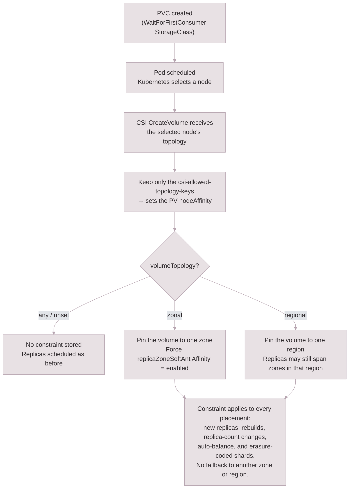

Topology-aware provisioning allows you to align Kubernetes pod placement and Longhorn data placement with the topology of your cluster. In multi-zone or multi-region clusters, this helps avoid permanent cross-zone or cross-region I/O when a pod is constrained to one failure domain but the replicas or erasure-coded shards backing the volume are scheduled somewhere else.

Longhorn has two levels of topology control:

- **PV topology** controls the `nodeAffinity` rules that Kubernetes writes into a PersistentVolume (PV). This determines where pods using the PV can run.
- **Volume topology** controls where Longhorn stores the volume data. This determines where replicas, rebuild replicas, auto-balance candidates, and erasure-coded shards can be placed.

By default, Longhorn keeps the existing behavior: StorageClasses without topology settings are unconstrained. To make a volume topology-aware, opt in with the `volumeTopology` StorageClass parameter.

## Prerequisites

1. Nodes in your cluster must be labeled with the topology keys you plan to use. Kubernetes automatically applies the well-known labels `topology.kubernetes.io/zone` and `topology.kubernetes.io/region` in most cloud environments. Verify with:

   ```shell
   kubectl get nodes --label-columns topology.kubernetes.io/zone,topology.kubernetes.io/region
   ```

2. Configure the **CSI Allowed Topology Keys** setting in Longhorn. Set the value to a comma-separated list of topology keys that Longhorn should use when building PV `nodeAffinity`.

   - **Longhorn UI**: Go to **Setting > General > CSI Allowed Topology Keys** and enter, for example, `topology.kubernetes.io/zone` or `topology.kubernetes.io/zone,topology.kubernetes.io/region`.
   - **Longhorn API / kubectl**:
     ```shell
     kubectl -n longhorn-system edit settings.longhorn.io csi-allowed-topology-keys
     ```
     Set the `value` field to the topology keys you want Kubernetes PVs to use.

   > **Note:** After changing this setting, manually restart the `longhorn-csi-plugin` DaemonSet for the change to take effect. Topology is applied correctly only after the CSI plugin pod on each node has restarted.

3. For topology-aware dynamic provisioning, set the StorageClass `volumeBindingMode` to `WaitForFirstConsumer`. This lets Kubernetes choose a consumer pod's node before Longhorn resolves the volume topology.

## How It Works

The following flowchart shows how a topology-aware volume is provisioned, from PVC creation to where the resolved failure domain is enforced:



When a PVC is created against a StorageClass that uses the Longhorn CSI driver, Kubernetes sends Longhorn a list of accessible topologies. Longhorn first filters those topology segments using `csi-allowed-topology-keys`. The filtered topology is used for the PV `nodeAffinity`.

If `volumeTopology` is unset or set to `any`, Longhorn does not store a volume placement constraint. Replica scheduling behaves as it did before.

If `volumeTopology` is set to `zonal` or `regional`, Longhorn resolves one failure domain at creation time and stores it in the Volume spec as `topologyRequirement`. Longhorn then returns that same resolved topology to Kubernetes so the PV `nodeAffinity` and Longhorn data placement refer to the same domain. The stored requirement is immutable and is enforced for initial replica placement, rebuilds, replica count changes, replica auto-balance, and erasure-coded shard placement. Longhorn does not fall back to a different zone or region when the resolved domain has no capacity.

Several fields work together:

| Field | Role |
|-------|------|
| `csi-allowed-topology-keys` (Longhorn setting) | Controls which topology keys Longhorn includes in PV `nodeAffinity`. If empty, PVs do not receive topology-based `nodeAffinity`. |
| `allowedTopologies` (StorageClass field) | Restricts which topology values are eligible. For example, you can limit provisioning to zones `a` and `b` out of `a`, `b`, and `c`. |
| `volumeBindingMode` (StorageClass field) | `WaitForFirstConsumer` (WFFC) delays provisioning until a pod is scheduled, giving the scheduler a preferred node. `Immediate` provisions right away. |
| `strictTopology` (StorageClass parameter) | Controls PV `nodeAffinity` only. When `"true"` and used with WFFC, the PV is pinned to the topology of the node selected for the first consumer pod. |
| `volumeTopology` (StorageClass parameter) | Controls Longhorn data placement. `any` leaves placement unconstrained, `zonal` pins the volume data to one zone, and `regional` pins it to one region. |

## Volume Topology Modes

| `volumeTopology` | Behavior |
|---|---|
| `any` or unset | Current behavior. Longhorn does not store a topology requirement. Replicas and shards can be scheduled anywhere allowed by the usual Longhorn scheduling rules. |
| `zonal` | Longhorn resolves one zone at volume creation time. The PV `nodeAffinity` and all Longhorn data placement remain inside that zone. |
| `regional` | Longhorn resolves one region at volume creation time. The PV `nodeAffinity` and all Longhorn data placement remain inside that region; replicas may still spread across zones within the region. |

For `zonal` volumes, Longhorn requires `replicaZoneSoftAntiAffinity` to be `enabled`. A zonal volume keeps all replicas in one zone, so hard zone anti-affinity cannot be satisfied for more than one replica. A StorageClass that explicitly sets both `volumeTopology: "zonal"` and `replicaZoneSoftAntiAffinity: "disabled"` is rejected during provisioning.

## Examples

The examples below assume a cluster with six nodes across three zones in one region:

| Node | Zone | Region |
|------|------|--------|
| node2 | a | us-central |
| node3 | b | us-central |
| node4 | c | us-central |
| node5 | a | us-central |
| node6 | b | us-central |
| node7 | c | us-central |

### PV-Only Zone Affinity

Use `allowedTopologies` and `csi-allowed-topology-keys` when you only need Kubernetes to restrict where pods using the PV can run.

**Longhorn setting:**

```
csi-allowed-topology-keys = topology.kubernetes.io/zone
```

**StorageClass:**

```yaml
kind: StorageClass
apiVersion: storage.k8s.io/v1
metadata:
  name: longhorn-zone-ab
provisioner: driver.longhorn.io
volumeBindingMode: WaitForFirstConsumer
parameters:
  numberOfReplicas: "3"
allowedTopologies:
  - matchLabelExpressions:
      - key: topology.kubernetes.io/zone
        values:
          - a
          - b
```

**Result:** The PV `nodeAffinity` is set to `zone in [a, b]`. Pods using the volume can only run in zones `a` or `b`. Longhorn replica placement is not pinned by this configuration and still follows the normal replica scheduler rules.

### Zonal Volume Placement

Use `volumeTopology: "zonal"` when you want the pod and all Longhorn data for the volume to remain in one zone.

**Longhorn setting:**

```
csi-allowed-topology-keys = topology.kubernetes.io/zone
```

**StorageClass:**

```yaml
kind: StorageClass
apiVersion: storage.k8s.io/v1
metadata:
  name: longhorn-zonal
provisioner: driver.longhorn.io
volumeBindingMode: WaitForFirstConsumer
parameters:
  numberOfReplicas: "3"
  volumeTopology: "zonal"
  replicaZoneSoftAntiAffinity: "enabled"
allowedTopologies:
  - matchLabelExpressions:
      - key: topology.kubernetes.io/zone
        values:
          - a
          - b
          - c
```

**Result:** Longhorn resolves the volume to the zone selected during provisioning. If the first consumer pod is scheduled on `node2`, the PV `nodeAffinity` is set to `zone in [a]`, and all replicas, rebuild replicas, auto-balance candidates, and erasure-coded shards for the volume must stay in zone `a`. If zone `a` has no capacity, scheduling waits instead of falling back to another zone.

### Regional Volume Placement

Use `volumeTopology: "regional"` when you want all Longhorn data to remain in one region while still allowing replicas to spread across zones inside that region.

**Longhorn setting:**

```
csi-allowed-topology-keys = topology.kubernetes.io/region
```

**StorageClass:**

```yaml
kind: StorageClass
apiVersion: storage.k8s.io/v1
metadata:
  name: longhorn-regional
provisioner: driver.longhorn.io
volumeBindingMode: WaitForFirstConsumer
parameters:
  numberOfReplicas: "3"
  volumeTopology: "regional"
allowedTopologies:
  - matchLabelExpressions:
      - key: topology.kubernetes.io/region
        values:
          - us-central
```

**Result:** The PV `nodeAffinity` is set to `region in [us-central]`, and Longhorn schedules the volume data only on nodes in `us-central`. Replicas may be placed in different zones within `us-central` according to the normal Longhorn scheduling and anti-affinity rules.

### Strict PV Pinning Without Volume Placement

Use `strictTopology: "true"` when you only want to narrow the PV `nodeAffinity` to the first consumer pod's selected topology and do not want Longhorn to persist a replica placement constraint.

```yaml
kind: StorageClass
apiVersion: storage.k8s.io/v1
metadata:
  name: longhorn-strict-pv-only
provisioner: driver.longhorn.io
volumeBindingMode: WaitForFirstConsumer
parameters:
  numberOfReplicas: "3"
  strictTopology: "true"
allowedTopologies:
  - matchLabelExpressions:
      - key: topology.kubernetes.io/zone
        values:
          - a
          - b
          - c
```

**Result:** The PV `nodeAffinity` is set to the selected zone, but Longhorn replicas are not constrained by that PV topology unless `volumeTopology` is also set.

## Behavior Reference

In the following table, `zone` is shorthand for `topology.kubernetes.io/zone`, `region` is shorthand for `topology.kubernetes.io/region`, and `[selected]` means the domain selected during provisioning.

| `volumeTopology` | Required topology key in `csi-allowed-topology-keys` | PV `nodeAffinity` | Longhorn data placement |
|---|---|---|---|
| unset or `any` | None | Depends on `allowedTopologies`, `strictTopology`, and allowed keys | Unconstrained by CSI topology |
| `zonal` | `zone` | zone in `[selected]` | Replicas and shards remain in `[selected]` zone |
| `regional` | `region` | region in `[selected]` | Replicas and shards remain in `[selected]` region |

**Key takeaways:**

- Without `volumeTopology`, Longhorn does not persist the PV topology as a replica or shard placement constraint.
- `strictTopology` only narrows PV `nodeAffinity`; it does not constrain Longhorn replica or shard scheduling.
- `volumeTopology: "zonal"` and `volumeTopology: "regional"` resolve one failure domain at creation time and keep the PV and Longhorn data placement aligned for the lifetime of the volume.
- If nodes have the requested topology label but `csi-allowed-topology-keys` does not include that key, provisioning with `volumeTopology: "zonal"` or `"regional"` is rejected. Add the required key to the setting and restart the CSI plugin.
- If nodes do not report the requested topology label at all, Longhorn creates the volume without a topology constraint. This allows one StorageClass to work on both labeled multi-zone clusters and unlabeled single-zone clusters.

## Notes and Warnings

- Do **not** use `allowedTopologies` together with `dataLocality: strict-local`. The PV `nodeAffinity` is immutable once set and will conflict with Longhorn's strict-local volume pinning. See [Data Locality](../../../high-availability/data-locality/) for details.
- Do **not** use `volumeTopology: "zonal"` together with `replicaZoneSoftAntiAffinity: "disabled"`. Longhorn rejects this combination because all replicas must stay in one zone.
- For zonal or regional volume placement, prefer `volumeBindingMode: WaitForFirstConsumer` so the resolved failure domain follows the first consumer pod's scheduling decision.
- Existing volumes and StorageClasses are unchanged unless you set `volumeTopology` on a StorageClass used for new PVCs.

## Related Documentation

- [Storage Class Parameters](../../../references/storage-class-parameters/)
- [CSI Allowed Topology Keys setting](../../../references/settings/#csi-allowed-topology-keys)
- [Scheduling](../scheduling)
